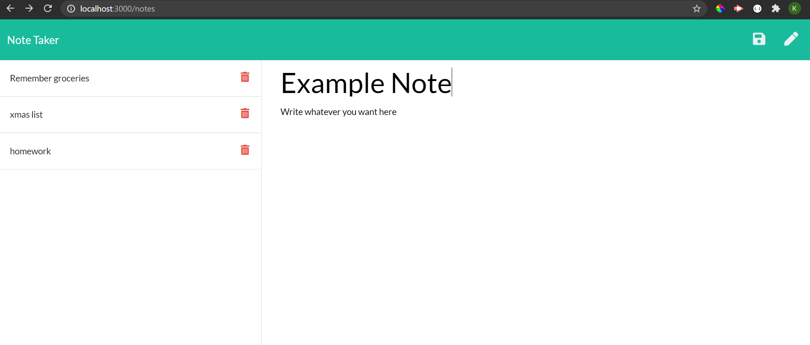

# note-taker

## Description
    Dynamically add and delete notes to a digital notebook! 

## Usage
    Run node server.js from the command line, and go to localhost:3000. Just change the PORT variable if you want to use a different port.

## Install 
    Clone the repository, and you're all set.

## Testing
    Enter a note, a check your db.JSON file to confirm data entry or deletion. Console log will also help. 

## Contributing
    Put in a pull request, or message me. I'd love to collaborate.

## Questions
   * Github: https://github.com/kshaq777
   * Email: [kshaq777@gmail.com](mailto:kshaq777@gmail.com)